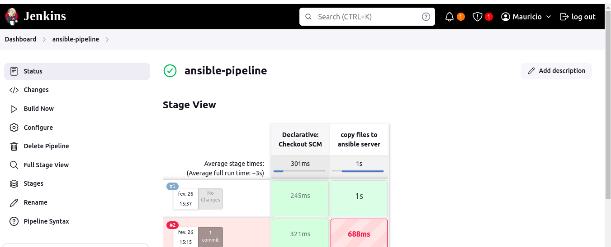
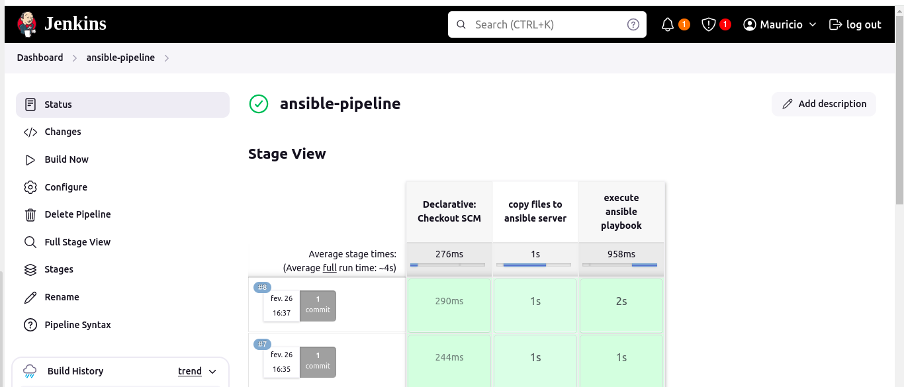

Ansible Integration in Jenkins

## Technologies Used

Ansible, Jenkins, DigitalOcean, AWS, Boto3, Docker, Java, Maven, Linux, Git

## Project Description

- Create and configure a dedicated server for Jenkins
- Create and configure a dedicated server for Ansible Control Node
- Write Ansible Playbook, which configures 2 EC2 Instances
- Add ssh key file credentials in Jenkins for Ansible Control Node server and Ansible Managed Node servers
- Configure Jenkins to execute the Ansible Playbook on remote Ansible Control Node server as
part of the CI/CD pipeline
- So the Jenkinsfile configuration will do the following:
    a. Connect to the remote Ansible Control Node server
    b. Copy Ansible playbook and configuration files to the remote Ansible Control Node server
    c. Copy the ssh keys for the Ansible Managed Node servers to the Ansible Control Node server
    d. Install Ansible, Python3 and Boto3 on the Ansible Control Node server
    e. With everything installed and copied to the remote Ansible Control Node server, execute the
    playbook remotely on that Control Node that will configure the 2 EC2 Managed Nodes

### Details of project   

Project files: https://github.com/Mauricio-Camilo/java-maven-app/tree/feature/ansible

- Create a New Instance for Installing Ansible

  The first step in preparing the Ansible control node is to create a new EC2 instance where Ansible will be installed.

  Commands to install Ansible:

  ```sh
    apt update
    apt install ansible-core  
  ```
- Install Python Module for AWS

  To allow Ansible to interact with AWS services, the boto3 Python module must be installed on the Ansible control node:

  ```sh
    apt install python3-boto3
  ```
- Configure AWS Credentials on the Server

  To enable the Ansible control node to connect to EC2 instances, the AWS credentials must be configured on the server. This can be done by creating a .aws/credentials file and copying the local AWS credentials into it.

  ```sh
    mkdir -p ~/.aws
    touch ~/.aws/credentials  
  ```
  The AWS credentials (access key and secret key) should be copied into this file for the server to authenticate with AWS.

- Create Two EC2 Instances to be Managed by Ansible

  Two EC2 instances are created to be managed by Ansible. A new keypair is also generated, specifically for this project, which allows Ansible to connect to these instances.

- Copy the Necessary Files via Jenkinsfile to the Ansible Node

  Files necessary for the Ansible setup are copied to the Ansible control node using the Jenkins pipeline. The java-maven-app repository (branch feature/ansible) is used for this purpose.

  Four essential files are copied into the Ansible directory:

    - ansible.cfg
    - inventory file
    - playbook yaml
    - private key

  These files were copied into a folder named ansible in the java-maven-app repository. This step is essential because the Jenkins server needs access to these files to trigger the pipeline and run Ansible on the control node.

- Add SSH Keys to Jenkins Credentials

  SSH keys for connecting to both the Ansible control node and the EC2 instances are added to the Jenkins credentials. This allows Jenkins to access both via SSH when running the pipeline.

- Create the Jenkinsfile

  A new Jenkinsfile is created to automate the process. The first step in the pipeline is to copy necessary files to the Ansible server.

  Jenkinsfile snippet to copy files:

  ```sh
    stage("copy files to ansible server") {
        steps {
            script {
                echo "copying all necessary files to ansible control node"
                sshagent(['ansible-server-key']) {
                    sh "scp -o StrictHostKeyChecking=no ansible/* root@52.91.249.56:/root"
                    withCredentials([sshUserPrivateKey(credentialsId: 'ec2-server-key', keyFileVariable: 'keyfile', userNameVariable: 'user')])
                    sh "scp ${keyfile} root@52.91.249.56:/root/ssh-key.pem"
                }
            }
        }
    }  
  ```

  This step copies the files to the Ansible server. The sshagent step is used for SSH authentication using the ansible-server-key. The second command also transfers the private key for connecting to the EC2 instances.

- Create a New Pipeline in Jenkins

  A new Jenkins pipeline is created to run the Jenkinsfile from the new branch of java-maven-app.

  Note: Since the Ansible control node is an EC2 instance, the default setup does not allow direct login with the root user. The public key of the instance must be modified to allow direct root login.

    

- Resolve Security Issue with SSH Key Exposure

  While the pipeline worked, there was a security issue regarding exposing the private key (keyfile) in the Groovy script. To mitigate this, a small change was made:

  ```sh
    sh 'scp $keyfile root@52.91.249.56:/root/ssh-key.pem'
  ```

  This adjustment ensures the key is used securely.

- Execute Ansible Playbooks from Jenkins

  A new stage is added to execute the playbook on the Ansible control node. The SSH Pipeline Steps plugin is used to run SSH commands on the remote server.

  ```sh
    stage("execute ansible playbook") {
        steps {
            script {
                echo "calling ansible playbook to configure ec2 instances"
                def remote = [:]
                remote.name = "ansible-server"
                remote.host = "52.91.249.56"
                remote.allowAnyHosts = true

                withCredentials([sshUserPrivateKey(credentialsId: 'ansible-server-key', keyFileVariable: 'keyfile', usernameVariable: 'user')]) {
                    remote.user = user
                    remote.identityFile = keyfile
                    sshCommand remote: remote, command: "ls -l"                }
            }
        }
    }  
  ```

  The sshCommand runs the Ansible playbook on the remote server, where the playbook installs Docker and Docker Compose on both EC2 instances.

    

- Final Adjustments and Pipeline Completion

  Once the pipeline ran successfully, it was updated to run the ansible-playbook my-playbook.yaml command. The playbook was executed on the EC2 instances, installing Docker and Docker Compose.

  A few optimizations were made:

  The public IP of the Ansible server was stored in a variable for easier configuration.
  A script (prepare-ansible-server.sh) was created to install Ansible and Python on the server. This script is called in the Jenkinsfile using:

  ```sh
    sshScript remote: remote, script: "prepare-ansible-server.sh"
  ```
  With this setup, the integration between Ansible and Jenkins was completed successfully, automating the provisioning and configuration of EC2 instances.
